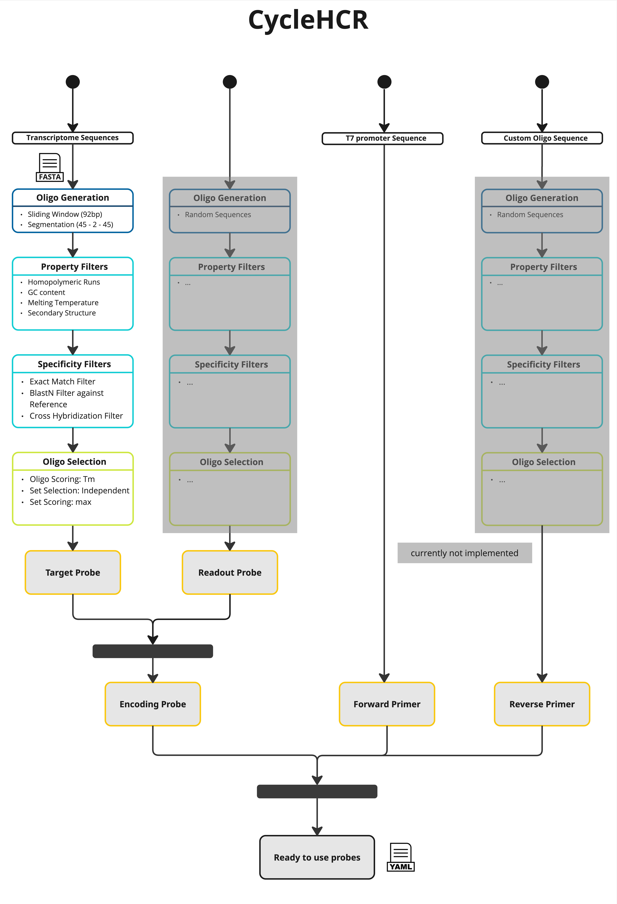

CycleHCR Probe Designer
==========================

CycleHCR (Cycle Hybridization Chain Reaction) technology leverages multicycle DNA barcoding and Hybridization Chain Reaction (HCR) to surpass
the conventional color barrier. CycleHCR facilitates high-specificity, single-shot imaging per target for RNA, mitigating the molecular crowding
issues encountered with other imaging-based spatial omics techniques, which can restrict the decoding capacity for targets that are either abundant
or exhibit heterogeneous distributions.

A CycleHCR encoding probe is a fluorescent probe that contains a 92-nt targeting sequence (divided into 45-nt segments for the left and right probe pairs,
separated by a 2-nt gap), which directs their binding to the specific RNA, two 14-nt barcode sequences, which are read out by fluorescent secondary readout
probes, TT-nucleotide spacers between readout and gene-specific regions, and two PCR primer binding sites. The specific readout sequences contained by an
encoding probe are determined by the binary barcode assigned to that RNA.

If you are using the CycleHCR Probe Design Pipeline, consider citing the Oligo Designer Toolsuite package [1].
The CycleHCR Probe Design Pipeline follows the design steps listed in [2].

Command-Line Call
------------------

To create CycleHCR probes you can run the pipeline with

::

    cyclehcr_probe_designer -c data/configs/cyclehcr_probe_designer.yaml

where:

``-c``: config file, which contains parameter settings, specific to CycleHCR probe design, `cyclehcr_probe_designer.yaml <https://github.com/HelmholtzAI-Consultants-Munich/oligo-designer-toolsuite/blob/main/data/configs/cyclehcr_probe_designer.yaml>`__ contains default parameter settings

All steps and config parameters will be documented in a log file, that is saved in the defined output directory.
The logging file will have the format: ``log_cyclehcr_probe_designer_{year}-{month}-{day}-{hour}-{minute}.txt``.

Python API
------------------

The CycleHCR probe design pipeline can also be integrated directly into Python code.
Below is an example demonstrating how this can be done.
For a complete explanation of all function parameters, refer to the API documentation.

.. code-block:: python

    ##### Initialize the CycleHCR Probe Designer Pipeline #####
    # We create an instance of the CycleHCRProbeDesigner class. This pipeline handles
    # all steps required to design probes for CycleHCR experiments, including target probes,
    # readout probes, primers, and final output.
    pipeline = CycleHCRProbeDesigner(
            write_intermediate_steps=True,
            dir_output="output_cyclehcr_probe_designer",
            n_jobs=2,
        )

    # Optional: If you need to customize certain developer parameters (for debugging, advanced usage, etc.),
    # call set_developer_parameters(...) with any overrides. By default, the pipeline uses internal defaults.
    pipeline.set_developer_parameters(...)

    ##### Design Target Probes #####
    # We first generate probes that hybridize specifically to target genes sequences.
    # The pipeline will generate multiple candidate sets (n_sets) and return them as part of the probe database.
    target_probe_database = pipeline.design_target_probes(
        gene_ids=...,                                           # List of gene symbols or identifiers
        files_fasta_target_probe_database=...,                  # List of FASTA files with target gene sequences
        files_fasta_reference_database_targe_probe=...,         # List of FASTA files for specificity reference
        target_probe_isoform_consensus=0,
        target_probe_L_probe_sequence_length=45,
        target_probe_gap_sequence_length=2,
        target_probe_R_probe_sequence_length=45,
        target_probe_GC_content_min=30,
        target_probe_GC_content_max=90,
        target_probe_Tm_min=90,
        target_probe_Tm_max=200, #arbitrary high value to get Tm as high as possible
        target_probe_homopolymeric_base_n={"A": 6, "T": 6, "C": 6, "G": 6},
        target_probe_T_secondary_structure=90,
        target_probe_secondary_structures_threshold_deltaG=0,
        target_probe_junction_region_size=13,
        target_probe_Tm_weight=1,
        target_probe_isoform_weight=10,
        set_size_opt=10,
        set_size_min=25,
        distance_between_target_probes=2,
        n_sets=30,
    )

    ##### Design Readout Probes #####
    # After we have generated valid target probes, we design short "readout probes" (barcodes) used in CycleHCR imaging.
    # A codebook is generated to map each gene to a unique barcode pattern.
    # The readout probe table contains the actual sequences and associated metadata for these probes.
    # Note: we currently do not support the design of readout probes but require the user to provide a pre-designed set.
    # Note: we currently do not provide the loading of a custom codebook.
    codebook, readout_probe_table = pipeline.design_readout_probes(
        n_regions=len(target_probe_database.database),
        file_readout_probe_table=...,                               # Optional: CSV file with pre-designed readout probe sequences
        file_codebook=...,                                          # Optional: CSV file with gene to barcode mapping
    )

    ##### Combine Target and Readout Probes into Encoding Probes #####
    # Merges the target probe database with the codebook/readout information to create the final
    # encoding probe database, which associates each target region with its readout sequences.
    encoding_probe_database = pipeline.design_encoding_probe(
        target_probe_database=target_probe_database,
        codebook=codebook,
        readout_probe_table=readout_probe_table,
        linker_sequence="TT",
    )

    ##### Design Primers #####
    # After we have generated valid encoding probes, we design primer sequences used for amplification.
    # Note: we currently do not support the design of the forward and reverse primer and require the user to provide a pre-defined sequence.
    reverse_primer_sequence, forward_primer_sequence = pipeline.design_primers(
        forward_primer_sequence="TAATACGACTCACTATAGCGTCATC",
        reverse_primer_sequence="CGACACCGAACGTGCGACAA",
    )

    ##### Generate Final Output #####
    # The pipeline then generates its final outputs for the 'top_n_sets'
    # best scoring probe sets to keep.
    pipeline.generate_output(
        encoding_probe_database=encoding_probe_database,
        reverse_primer_sequence=reverse_primer_sequence,
        forward_primer_sequence=forward_primer_sequence,
        top_n_sets=3,
    )

Pipeline Description
-----------------------

The pipeline has four major steps:

1) probe generation (dark blue),

2) probe filtering by sequence property and binding specificity (light blue),

3) probe set selection for each gene (green), and

4) final probe sequence generation (yellow).

For the probe generation step, the user has to provide a FASTA file with genomic sequences which is used as reference for the generation of probe sequences.
The probe sequences are generated using the ``OligoSequenceGenerator``.
Therefore, the user has to define the probe length (can be given as a range), and optionally provide a list of gene identifiers (matching the gene identifiers of the annotation file) for which probes should be generated.
If no gene list is given, probes are generated for all genes in the reference.
The probe sequences are generated in a sliding window fashion from the DNA sequence of the non-coding strand, assuming that the sequence of the coding strand represents the target sequence of the probe.
The generated probes are stored in a FASTA file, where the header of each sequence stores the information about its reference region and genomic coordinates.
In a next step, this FASTA file is used to create an ``OligoDatabase``, which contains all possible probes for a given set of genes.
When the probe sequences are loaded into the database, all probes of one gene having the exact same sequence are merged into one entry, saving the transcript, exon and genomic coordinate information of the respective probes.

In the second step, the number of probes per gene is reduced by applying different sequence property (``PropertyFilter``) and binding specificity filters (``SpecificityFilter``).
For the CycleHCR protocol, the following filters are applied: removal of sequences that contain unidentified nucleotides (``HardMaskedSequenceFilter``), that have a GC content (``GCContentFilter``) or melting temperature (``MeltingTemperatureNNFilter``) outside a user-specified range, that contain homopolymeric runs of any nucleotide longer than a user-specified threshold (``HomopolymericRunsFilter``), that contain secondary structures like hairpins below a user-defined free energy threshold (``SecondaryStructureFilter``).
After removing probes with undesired sequence properties from the database, the probe database is checked for probes that potentially cross-hybridize, i.e. probes from different genes that have the exact same or similar sequence.
Those probes are removed from the database to ensure uniqueness of probes for each gene.
Cross-hybridizing probes are identified with the ``CrossHybridizationFilter`` that uses a BlastN alignment search to identify similar sequences and removes those hits with the ``RemoveByBiggerRegionPolicy`` that sequentially removes the probes from the genes that have the bigger probe sets.
Next, the probes are checked for off-target binding with any other region of a provided background reference.
Off-target regions are sequences of the background reference (e.g. transcriptome or genome) which match the probe region with a certain degree of homology but are not located within the gene region of the probe.
Those off-target regions are identified with the ``BlastNFilter`` that removes probes where a BlastN alignment search found off-target sequence matches with a certain coverage and similarity, for which the user has to define thresholds.

In the third step of the pipeline, the best sets of non-overlapping probes are identified for each gene.
The ``OligosetGeneratorIndependentSet`` class is used to generate ranked, non-overlapping probe sets where each probe and probe set is scored according to a protocol dependent scoring function, i.e. by the weighted melting temperature and isoform consensus score of the probes in the set.
Following this step all genes with insufficient number of probes (user-defined) are removed from the database and stored in a separate file for user-inspection.

In the last step of the pipeline, the ready-to-order probe sequences containing all additional required sequences are designed for the best non-overlapping sets of each gene.
For the CycleHCR protocol two readout sequences are added to the probe, creating the encoding probes.
The readout probes have to be provided by the user and are assigned to the probes according to a protocol-specific encoding scheme described in Gandin et al. [2].
In addition, one forward and one reverse primer is provided.
The forward primer is the T7 promoter sequence (TAATACGACTCACTATAGCGTCATC) and the reverse primer is a provided custom oligo sequence.

The output is stored in two separate files:

- ``cyclehcr_probes_order.yml``: contains for each probe the sequences of the cyclehcr probe and the readout probes.
- ``cyclehcr_probes.yml``: contains a detailed description for each probe, including the sequences of each part of the probe and probe specific attributes.

All default parameters can be found in the `cyclehcr_probe_designer.yaml <https://github.com/HelmholtzAI-Consultants-Munich/oligo-designer-toolsuite/blob/main/data/configs/cyclehcr_probe_designer.yaml>`__ config file provided along the repository.

.. [1] Mekki, I., Campi, F., Kuemmerle, L. B., ... & Barros de Andrade e Sousa, L. (2023). Oligo Designer Toolsuite. Zenodo, https://doi.org/10.5281/zenodo.7823048
.. [2] Gandin, V., Kim, J., Yang, LZ, ..., Liu, Z.J. (2025). Deep-tissue transcriptomics and subcellular imaging at high spatial resolution. Science, eadq2084. https://doi.org/10.1126/science.adq2084
